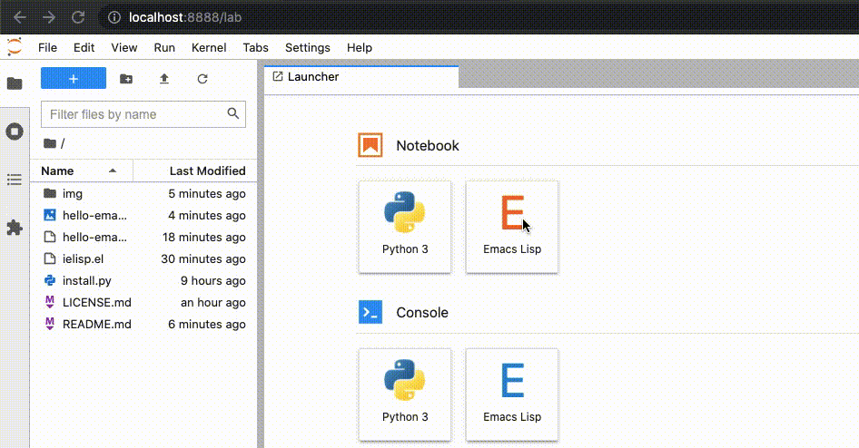

# ielisp - Emacs Lisp Kernel for Jupyter

`ielisp` lets you run Emacs Lisp from Jupyter Notebook or Jupyter Lab.



## Getting started

* Clone or download this repository:

  ```
  git clone https://github.com/shwina/ielisp
  ```

* Install and/or ensure that you have the dependencies

  - Emacs
  - [Jupyter](https://github.com/jupyter/notebook).
  - The Emacs package [`emacs-zmq`](https://github.com/nnicandro/emacs-zmq)
    and _its_ dependency [`libzmq`]. Note that you need a version of libzmq
    built with DRAFT APIs.

* Once the dependecies are met, navigate to the `ielisp` directory
  and run the `install.py` script. If you use Jupyter in a virtualenv,
  activate it _before_ this step:

  ```
  cd ielisp
  python install.py
  ```

That's it! If you start Jupyter Notebook or Jupyter Lab,
you will be able to choose "Emacs Lisp" as the language for your kernel.
